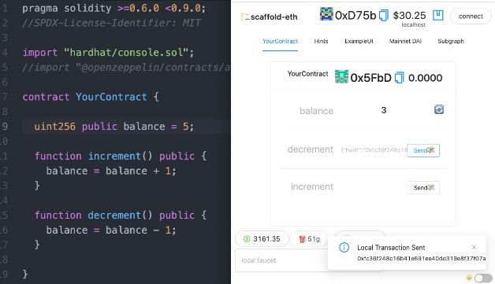

# 🏗 Welcome to Scaffold-eth

## About Scaffold-eth

Scaffold-eth provides an off-the-shelf stack for rapid prototyping on Ethereum, giving developers access to state-of-the-art tools to quickly learn and ship an Ethereum-based dApp. 


🤿 Scaffold-eth quick intro


## The Scaffold-eth stack

Scaffold-eth is not a product itself but more of a combination or stack of other great products. It allows you to quickly build and iterate over your smart contracts and frontends. It leverages:

* **Solidity **for writing smart contracts.
* **Hardhat** for running local networks, deploying and testing smart contracts.
* **React** for building a frontend, using many useful pre-made components and hooks.
* **Ethers.js **for interacting with deployed smart contracts and the frontend
* **Ant** for your UI. But can be easily changed to Bootstrap or some other library you prefer.

## About this Guide

The Scaffold-eth documentation is broken up into **three main sections**. 

\
**1.** **Getting Started **- In the **Getting Started** section we start by going over how to install and run the sample project included with Scaffold-eth, as well as key pieces you can tweak to start learning how it works and how it interacts with Hardhat and React. The goal here is to get new developers up and running on Scaffoled-eth lightning fast. ⚡️

**2. Toolkit** - In the **Toolkit **section we cover a brief overview of the tools the Scaffold-eth wraps and utilizes, we look at some of the unique frontend resources that Scaffold-eth provides out of the box, and we look at some of the extra infrastructure features that can be helpful as developers begin to create more sophisticated projects.

**3. Challenge Course and Tutorials** - In the **Challenge Course and Tutorials **sections we provide a challenge course of tasks that you can take on to level-up your Scaffold-eth and web3 skills, as well as a catalog of recipes for some of the unique value props that web3 and the Ethereum ecosystem provides. Looking for some inspiration? Check out the cookbook and start mixing and mashing. 

Check the **Built with Scaffold-eth** section to see some production-grade projects built with Scaffold-eth.

BuidlGuidl.com is a community that builds solutions based on Scaffold-eth. Learn more about it on the **BuidlGuidl.com** section.

Finally, if you are running into some issue, check the **Support** section to find out how to get some help or troubleshoot some common problems people usually run into.

Wanna help Scaffold-eth grow? Is there some feature you'd like implemented? Did you run into a bug or did you solve one? Read the **Contributing to Scaffold-eth** section to learn how you can help.
