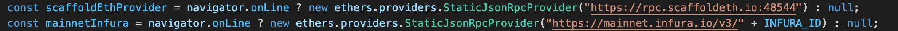

# 🛠 Ethers

Ethers.js is a library for interacting with your deployed smart contracts from the frontend. Scaffold-eth abstracts much of Ethers from developers and provides common react hooks, helpers, and components that already have Ethers backed. \
\
As with the other tools in the Scaffold-eth stack is very helpful to [read the docs](https://docs.ethers.io/v5/) so that you can extend your use cases beyond what Scaffold-eth provides and roll your own frontend if needed. 

Some common uses of Ethers is to connect to and call functions on a particular smart contract instance, and to instantiate providers and signers. 

